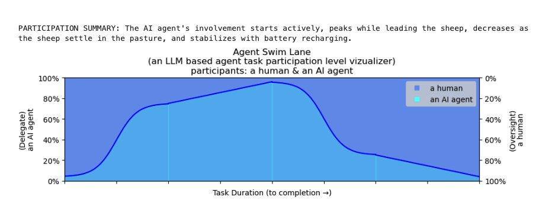

## Agent SwimLanes  🦦

Given a task description, Draw agent participation timeline


```python
task_description_1 = """
Feeding Routine Optimization: We've designed a task where the AI robot assists in the feeding routine. 
The farmhand starts by distributing feed to the livestock, and the robot monitors feed levels in the troughs. 
When a trough is low, the robot automatically refills it, ensuring all animals receive adequate nutrition. 
This intervention at critical moments helps maintain consistent feeding schedules and 
frees up the farmhand to focus on other essential tasks.
"""
```

